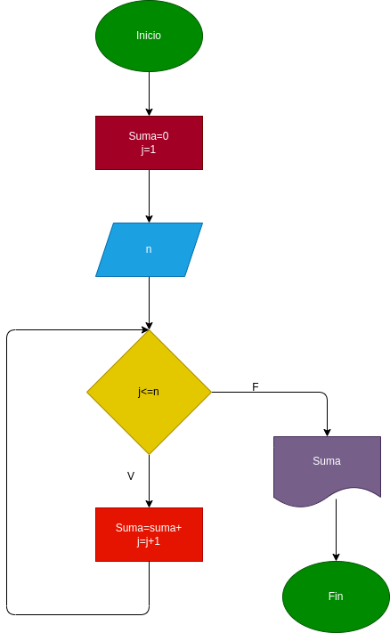

# Ejercicio para detenerminar la suma de los N primeros números naturales

El usuario digita un número. Se hace el proceso de suma=suma+j, y el resultado seria la suma de N números que el usuario digito. 

